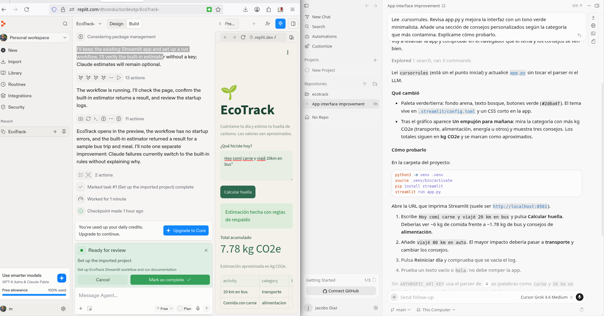

# 🌱 EcoTrack

MVP web que estima la **huella de carbono diaria** a partir de una frase en lenguaje natural, por ejemplo: *"Hoy comí carne y viajé 20km en bus"*. Fue construido con la metodología **Vibe Coding**: el código se generó y se iteró con agentes de IA (Cursor y Replit), y mi trabajo fue definir la visión, las reglas y verificar el resultado.

- **App desplegada:** https://erayt5kwopqjyqmdzdw9wk.streamlit.app/
- **Repositorio:** https://github.com/Jacobo2025/EcoTrack-

---

## 1. ¿Qué hace la app?

1. El usuario escribe qué hizo durante el día.
2. La app identifica actividades (transporte y alimentación) y estima sus emisiones en **kg CO₂e**.
3. Muestra el total acumulado, una tabla de actividades y un gráfico de barras por categoría.
4. Ofrece consejos personalizados según la categoría que más contamina (sección "Un empujón para mañana", añadida con el Composer de Cursor).
5. Permite reiniciar el día.

**Ejemplo:** *"Hoy comí carne y viajé 20km en bus"* → 6.00 kg (comida con carne) + 1.78 kg (20 km × 0.089) = **7.78 kg CO₂e**.

### Dos motores de estimación

| Motor | Cuándo se usa | Cómo funciona |
|---|---|---|
| **IA (Claude)** | Si existe la variable `ANTHROPIC_API_KEY` | El modelo (por defecto `claude-sonnet-5`, configurable con `ANTHROPIC_MODEL`) devuelve un JSON con actividades, categoría y kg CO₂e. |
| **Reglas de respaldo** | Sin API key o si Claude falla | Expresiones regulares y palabras clave con factores de emisión fijos. |

La app **nunca se rompe** si el modelo falla: cae al parser de reglas. Un mensaje en pantalla indica qué motor hizo la estimación.

### Factores de emisión del modo de reglas (aproximados)

| Transporte | kg CO₂e por km | Alimentación | kg CO₂e por comida |
|---|---|---|---|
| Bus / autobús | 0.089 | Carne / res | 6.0 |
| Auto / carro / coche | 0.17 | Cerdo | 2.5 |
| Moto | 0.10 | Pollo | 1.6 |
| Metro | 0.04 | Pescado | 1.5 |
| Avión | 0.15 | Huevo / vegetariano | 0.8 |
| Bici / bicicleta | 0.0 | Ensalada | 0.4 |

> Son promedios orientativos, no mediciones exactas. La interfaz lo advierte.

---

## 2. Estructura del proyecto

```
EcoTrack-/
├── app.py                 # Aplicación Streamlit (parser, cálculo y UI)
├── requirements.txt       # streamlit, anthropic
├── .cursorrules           # Reglas del agente de IA (Cursor)
├── .replit                # Configuración de ejecución en Replit
├── .streamlit/config.toml # Tema verde/tierra (creado por el agente de Cursor)
├── .gitignore             # Excluye .venv, __pycache__, .env
├── VIBE_REPORT.md         # Reflexión sobre el proceso (máx. 500 palabras)
└── README.md              # Este documento
```

**Diseño de `app.py`:** funciones pequeñas y separadas: `normalize` (limpia texto y tildes), `parse_with_rules` (respaldo), `parse_with_llm` (Claude), `estimate` (elige motor con respaldo automático) y la interfaz Streamlit.

---

## 3. Cómo ejecutarlo en local

```bash
git clone https://github.com/Jacobo2025/EcoTrack-.git
cd EcoTrack-
python3 -m venv .venv
source .venv/bin/activate
pip install -r requirements.txt
streamlit run app.py
```

Se abre en http://localhost:8501.

**Opcional (IA real):**

```bash
export ANTHROPIC_API_KEY="tu_clave"
export ANTHROPIC_MODEL="claude-sonnet-5"   # opcional
```

Nunca escribas la clave dentro del código. En Replit se guarda en *Secrets*, y en Streamlit Cloud en *Advanced settings → Secrets*.

**Pruebas sugeridas:**
1. `Hoy comí carne y viajé 20km en bus` → 7.78 kg CO₂e.
2. `viajé 80 km en auto` → el transporte pasa a ser la categoría dominante y cambian los consejos.
3. `hola` → aviso amarillo, sin errores.
4. Botón **Reiniciar día** → vacía el registro.

---

## 4. Qué hicimos, paso a paso

### Fase 1: Preparación del entorno
1. **Cursor:** instalé el IDE, creé la carpeta del proyecto y añadí `.cursorrules` y `app.py`.
2. **Replit:** creé la cuenta e importé el repositorio desde GitHub.
3. **Modelos:** usé los agentes integrados de Cursor y Replit; la app opcionalmente llama a Claude con la API de Anthropic.

### Fase 2: El "vibe" inicial
1. Ejecuté la app en local (`localhost:8501`) y verifiqué el cálculo.
2. En el Composer de Cursor usé este prompt:
   > *"Lee .cursorrules. Revisa app.py y mejora la interfaz con un tono verde minimalista. Añade una sección de consejos personalizados según la categoría que más contamina. Explícame cómo probarlo."*
   
   El agente aplicó una paleta verde/tierra, creó `.streamlit/config.toml`, añadió la sección de consejos y respetó la regla de no tocar el parser.
3. Detecté que los archivos de configuración quedaron sin punto inicial (`cursorrules`, `replit`) y los renombré a `.cursorrules` y `.replit`.
4. Creé un `.gitignore` para no subir el entorno virtual `.venv`.
5. Subí todo a GitHub.

### Fase 3: Despliegue
1. **Replit:** el agente configuró el workflow de Streamlit y la app corrió correctamente en la vista previa.
2. Se agotaron los **créditos diarios** del agente, y la **publicación en Replit Cloud falló**. Además, el plan gratuito hace expirar las apps publicadas a los 30 días.
3. **Solución:** desplegué el mismo repositorio en **Streamlit Community Cloud** (gratuito), que redespliega automáticamente con cada `git push`.

### Fase 4: Documentación
Redacté el `VIBE_REPORT.md` y este README, y tomé una captura con Cursor y Replit operando en conjunto.

---

## 4.1 El ecosistema: Cursor → GitHub → Replit → Streamlit Cloud

```
Cursor (agente + .cursorrules)  →  GitHub (versionado)  →  Replit (validación en la nube)  →  Streamlit Cloud (URL pública)
```

| Herramienta | Rol en el flujo | Evidencia |
|---|---|---|
| **Cursor** | Genera y modifica el código siguiendo `.cursorrules` | Captura y prompts de la sección 4 |
| **GitHub** | Fuente única del código; cada push redespliega | Historial de commits |
| **Replit** | Importa el repo, configura el workflow y valida que la app corra | Captura con la app dando 7.78 kg CO₂e |
| **Streamlit Cloud** | Publica la URL pública gratuita | Enlace de la app |

## 4.2 Evidencia: Cursor y Replit en conjunto



*A la izquierda, Replit con la app corriendo (7.78 kg CO₂e). A la derecha, Cursor ejecutando el prompt del Composer para mejorar la interfaz.*

## 4.3 Ciclos de iteración con la IA

| # | Problema detectado | Prompt / acción | Resultado |
|---|---|---|---|
| 1 | Interfaz básica | Composer: tema verde minimalista y consejos según la categoría que más contamina | Paleta verde/tierra, `.streamlit/config.toml` y sección "Un empujón para mañana", sin tocar el parser |
| 2 | Cursor avisó de que leía `cursorrules` sin el punto | Verifiqué con `ls -a` y renombré a `.cursorrules` y `.replit` | Las reglas quedaron activas y el repo consistente |
| 3 | El agente creó `.venv` y no había `.gitignore` | Creé `.gitignore` y revisé con `git status` antes del commit | El repo solo contiene archivos del proyecto |
| 4 | Replit detectó que Claude falla y se usa el respaldo sin explicar el motivo | Composer: mostrar aviso con el motivo, sin tocar los factores | Aviso amarillo con la causa (sin API key, red o respuesta inválida) |
| 5 | Replit: créditos agotados y publicación fallida | Desplegar el mismo repo en Streamlit Cloud | URL pública funcionando |

## 5. Contenido de `.cursorrules`

Define la "personalidad" y las reglas del agente. Está organizado en cinco bloques:

```
# Rol
Eres el copiloto senior de EcoTrack, un MVP web que estima la huella de carbono
diaria a partir de texto en lenguaje natural. Yo defino la visión; tú escribes
y ejecutas el código.

# Stack
- Python 3.11 + Streamlit. Sin frameworks extra salvo que los pida.
- LLM: API de Anthropic (modelo en variable de entorno ANTHROPIC_MODEL).
- Secretos solo en variables de entorno (Replit Secrets). Nunca en el código.

# Estilo de código
- Limpio y modular: separa parsing, cálculo y UI en funciones pequeñas (<30 líneas).
- Type hints y docstrings de una línea.
- Nombres en inglés, textos de interfaz en español.
- Sin código muerto ni comentarios obvios.

# Comportamiento
- Antes de programar algo grande, resume tu plan en 3-5 viñetas.
- Si hay un error, diagnostica la causa raíz y corrígela; no me pidas arreglar sintaxis.
- Cambios mínimos: no reescribas archivos completos si basta un parche.
- Toda estimación de CO2 debe indicar unidad (kg CO2e) y ser transparente sobre
  que es aproximada.
- Si el LLM falla, usa el parser de respaldo por reglas; la app nunca debe romperse.
- Tras cada cambio, dime en una línea cómo probarlo.

# Diseño ("vibe")
Minimalista, tono verde/tierra, cercano y motivador. Un campo de texto, un botón,
resultados claros.
```

**Por qué funciona:** el stack fijo evita arquitecturas innecesarias; "cambios mínimos" protege el código que ya funciona; la regla de resiliencia garantiza el respaldo; y "dime cómo probarlo" mantiene mi rol de verificador.

---

## 6. Contenido de `VIBE_REPORT.md`

### 1. Cómo configuré las reglas del agente
Escribí un `.cursorrules` con cinco bloques: rol, stack, estilo, comportamiento y diseño. Tomé tres decisiones de diseño antes de pedirle nada al agente: fijar Python + Streamlit para evitar arquitecturas innecesarias, exigir "cambios mínimos" para proteger el código que ya funcionaba, y obligar a que la app tuviera un parser de respaldo si el modelo fallaba. También le pedí explicar cómo probar cada cambio, así mi rol quedó como el de verificador y no el de programador.

### 2. Dificultades y cómo las resolví con la IA
- **Archivos de configuración sin punto.** Cursor me avisó de que había leído `cursorrules` "sin el punto inicial": mi archivo no se llamaba `.cursorrules`, así que las reglas podían no aplicarse. Lo detecté con `ls -a`, lo renombré, y también corregí `replit` a `.replit`.
- **Entorno virtual en el repositorio.** El agente creó una carpeta `.venv` y yo no tenía `.gitignore`; un `git add .` habría subido miles de archivos de librerías. Creé el `.gitignore` antes del commit y comprobé con `git status` que solo se subieran los archivos del proyecto.
- **Fallo silencioso del modelo.** El agente de Replit señaló que, si Claude falla, la app cae al parser de reglas sin explicar por qué. Se lo devolví al Composer de Cursor como un prompt acotado (mostrar el motivo sin tocar el cálculo) y lo probé sin API key y con una clave falsa.
- **Créditos y despliegue.** Los créditos diarios de Replit se agotaron y su publicación falló. Como plan B desplegué el mismo repositorio en Streamlit Community Cloud, que es gratuito y se actualiza con cada `git push`.
- **Verificación.** No acepté el código a ciegas: probé "Hoy comí carne y viajé 20km en bus" (7.78 kg CO2e), una frase de 80 km en auto, un texto vacío y "hola".

### 3. De escribir código a orquestar una visión
Mi pregunta cambió de "¿cómo se escribe esto?" a "¿qué debe lograr y cómo sabré que funciona?". Las tres dificultades reales de arriba las detecté yo o el agente, pero la decisión de qué arreglar, con qué prompt y cuándo era suficiente para un MVP fue mía. Aprendí que delegar exige más precisión, no menos: un prompt vago habría cambiado el cálculo; uno acotado ("no toques los factores") mantuvo estable lo que ya funcionaba. Mi flujo fue Cursor para generar, GitHub para versionar, Replit para validar en la nube y Streamlit Cloud para publicar. La IA acelera la escritura, pero el criterio, las pruebas y la responsabilidad del resultado siguen siendo del desarrollador.

---

## 7. Relación con la rúbrica de evaluación

| Criterio | Qué se espera (Excelente, 90-100) | Evidencia en este proyecto |
|---|---|---|
| **Integridad del ecosistema** | Integración entre Cursor y Replit, con reglas personalizadas claras y funcionales. | **Flujo:** Cursor → GitHub → Replit → Streamlit Cloud (sección 4.1). **Reglas:** `.cursorrules` con rol, stack, estilo, comportamiento y diseño (sección 5). **Captura** de Cursor y Replit operando juntos (sección 4.2). Replit importó el repo, configuró el workflow de Streamlit y validó la app (7.78 kg CO₂e). |
| **Ejecución técnica (orquestación)** | Prototipo sin errores críticos, uso de la IA para resolver problemas y una interfaz coherente con el "vibe". | **App funcional** con URL pública y doble motor (Claude o reglas de respaldo) que nunca se rompe (sección 1). **Cinco ciclos de iteración** problema → prompt → resultado (sección 4.3). **Interfaz** verde/tierra y consejos personalizados, generados con el Composer de Cursor. |
| **Mentalidad de Vibe Coding** | Comprensión profunda de la delegación a la IA y prioridad de la intención y el diseño de alto nivel sobre la codificación manual. | **Vibe Report** (sección 6): decisiones de diseño propias, dificultades reales y reflexión sobre pasar de escribir código a orquestar una visión. **Prompts acotados** (por ejemplo, "no toques los factores") y **verificación manual** con frases de prueba (sección 3). |

### Entregables solicitados

| Entregable | Dónde está |
|---|---|
| URL del repositorio o Repl | https://github.com/Jacobo2025/EcoTrack- · App: https://erayt5kwopqjyqmdzdw9wk.streamlit.app/ |
| Archivo `.cursorrules` | Raíz del repositorio (contenido en la sección 5) |
| Vibe Report (máx. 500 palabras) | `VIBE_REPORT.md` (contenido en la sección 6) |
| Captura de Cursor y Replit | `labswnt.png` (sección 4.2) |

---

## 8. Limitaciones conocidas

- Solo reconoce transporte y alimentación en el modo de reglas; energía y otras categorías dependen del modo IA.
- Los factores de emisión son aproximados y no distinguen país, tamaño de porción ni tipo de vehículo.
- Sin base de datos: el registro se guarda solo en la sesión y se pierde al recargar la página.
- Sin API key no se usa IA real (modo de reglas).
- Si el modelo falla, la app cae al respaldo y muestra un aviso con el motivo (ciclo 4).

## 9. Próximos pasos

- Añadir energía eléctrica, vuelos y residuos.
- Guardar el historial diario con una base de datos.
- Pruebas automatizadas del parser.

## 10. Herramientas

**Cursor** (agente y reglas) · **Replit** (importación y ejecución en la nube) · **Streamlit Community Cloud** (despliegue) · **GitHub** (control de versiones) · **Python + Streamlit** · **API de Anthropic** (opcional).
